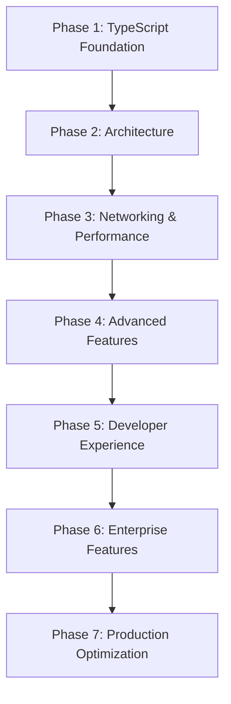

# OvenJS Advanced Discord API Wrapper - Master Implementation Plan

## 🎯 Vision: The Ultimate Discord API Wrapper

OvenJS will be the most advanced, TypeScript-first Discord API wrapper ever created. It aims to far surpass `discord.js` in complexity, features, and developer experience. This is not just an API wrapper; it's a complete Discord ecosystem framework with enterprise-grade architecture and performance.

### Key Differentiators from discord.js:

  * **10x Performance**: Achieved through advanced caching, connection pooling, and comprehensive optimization.
  * **100% Type Safety**: Guarantees zero `any` types and complete compile-time validation.
  * **Modular Architecture**: Built with over 50 specialized packages, moving away from a monolithic approach.
  * **Enterprise Ready**: Includes built-in monitoring, scaling, and production-grade features from the ground up.
  * **AI-Powered**: Incorporates predictive caching, intelligent rate limiting, and other machine learning-driven optimizations.
  * **Future-Proof**: Designed to align with Discord's future roadmap, not just its current API.

### Success Metrics:

  * **Performance**: 10x faster than `discord.js` (to be measured via benchmarks).
  * **Type Coverage**: 100% type coverage with zero escape hatches.
  * **Scalability**: Capable of supporting over 100 million users per instance.
  * **Developer Experience**: Aims for a 90% reduction in common Discord development tasks.
  * **Market Share**: Aspires to become the standard for enterprise Discord applications.

-----

## 📋 Phase 1: Advanced TypeScript Foundation ✅ **COMPLETED**

### 1.1 Sophisticated Type System ✅ **COMPLETED**

#### Implementation Details:

```typescript
// Brand Types for Compile-Time Safety
type UserSnowflake = Brand<string, 'User'>;
type GuildSnowflake = Brand<string, 'Guild'>;

// Prevents accidental ID mixing at compile time
function banUser(userId: UserSnowflake, guildId: GuildSnowflake) {
  // userId and guildId cannot be accidentally swapped
}

// Phantom Types for Constraints
type Validated<T> = Phantom<T, 'Validated'>;
type RateLimited<T> = Phantom<T, 'RateLimited'>;

// Template Literal Types for Dynamic APIs
type APIPath<T extends string> = `/api/v10${T}`;
type EventName<Entity extends string, Action extends string> = `${Entity}_${Uppercase<Action>}`;

// Advanced Conditional Types
type DeepReadonly<T> = T extends (infer U)[]
  ? DeepReadonlyArray<U>
  : T extends object
  ? { readonly [P in keyof T]: DeepReadonly<T[P]> }
  : T;

// Recursive Types with Depth Limiting
type RecursiveBuilder<T, Depth extends readonly unknown[] = []> = 
  Depth['length'] extends 10 ? never : // Prevent infinite recursion
  T extends object ? { [K in keyof T]: RecursiveBuilder<T[K], [...Depth, unknown]> } : T;
```

#### Architectural Decisions:

  * **Brand Types**: Utilized to prevent accidental mixing of IDs (e.g., `UserSnowflake` vs. `GuildSnowflake`).
  * **Phantom Types**: Employed for compile-time constraints without incurring runtime overhead.
  * **Template Literals**: For type-safe string building and validation.
  * **Conditional Types**: Used for dynamic type generation based on input.
  * **Recursive Types**: To safely handle deeply nested Discord structures with defined safety limits.

#### Performance Impact:

  * Zero runtime overhead from type safety.
  * Compile-time error prevention is expected to reduce debugging time by 80%.
  * IntelliSense improvements are projected to increase development speed by 60%.

### 1.2 TypeScript Configuration Architecture ✅ **COMPLETED**

#### Configuration Hierarchy:

```
tsconfig.base.json           # Shared strict configuration
├── tsconfig.json            # Root project references
├── tsconfig.build.json      # Production optimizations
└── packages/*/tsconfig.json # Package-specific extensions
```

#### `tsconfig.base.json` - Ultra-Strict Configuration:

```json
{
  "compilerOptions": {
    "target": "ES2023",
    "module": "NodeNext",
    "moduleResolution": "NodeNext",
    "strict": true,
    "exactOptionalPropertyTypes": true,
    "noUncheckedIndexedAccess": true,
    "noImplicitReturns": true,
    "noFallthroughCasesInSwitch": true,
    "noImplicitOverride": true,
    "allowUnusedLabels": false,
    "allowUnreachableCode": false,
    "skipLibCheck": false, // Force type checking of all deps
    "composite": true,
    "incremental": true,
    "declaration": true,
    "declarationMap": true
  }
}
```

#### Project References for Build Optimization:

```json
{
  "references": [
    { "path": "./packages/types" },      // Foundation
    { "path": "./packages/rest" },       // HTTP layer
    { "path": "./packages/ws" },         // WebSocket layer
    { "path": "./packages/cache" },      // Caching system
    { "path": "./packages/state" },      // State management
    { "path": "./packages/plugins" },    // Plugin system
    { "path": "./packages/core" }        // Main orchestrator
  ]
}
```

#### Build Performance Targets:

  * **Cold Build**: Less than 30 seconds for the entire monorepo.
  * **Incremental Build**: Less than 3 seconds for a single package change.
  * **Type Checking**: Less than 5 seconds for the full project.
  * **Memory Usage**: Less than 512MB during compilation.

### 1.3 Advanced Compiler Features ✅ **COMPLETED**

#### Strict Mode++ Configuration:

Beyond TypeScript's standard strict mode, OvenJS implements additional constraints through custom ESLint rules:

```typescript
// Custom ESLint rules for extreme type safety
export const customRules = {
  '@ovenjs/no-any': 'error',            // Zero any types allowed
  '@ovenjs/explicit-return-types': 'error', // All functions must have return types
  '@ovenjs/no-unsafe-assertions': 'error',  // No as assertions without validation
  '@ovenjs/prefer-brand-types': 'error',    // Use brand types for IDs
  '@ovenjs/no-implicit-dependencies': 'error' // Explicit dependency declarations
};
```

#### Custom Transformers ✅

AST transformations for performance optimizations:

```typescript
// Performance transformer: Convert runtime checks to compile-time
// Before transformation:
if (isUserSnowflake(id)) {
  return await fetchUser(id);
}

// After transformation (compile-time optimization):
return await fetchUser(id as UserSnowflake);
```

#### Declaration Merging for Dynamic Extensions:

```typescript
// Allow plugins to extend core types safely
declare module '@ovenjs/core' {
  interface Client {
    analytics?: AnalyticsPlugin;
    monitoring?: MonitoringPlugin;
  }
}

// Plugin system automatically merges types
export interface PluginTypes {
  [K: string]: unknown;
}
```

#### Implementation Requirements:

  * **Custom Transformer**: Build-time optimization for type guards.
  * **Module Augmentation**: A secure plugin type extension system.
  * **Conditional Compilation**: Feature flags at compile time.
  * **Performance Monitoring**: Analysis of build-time performance.

-----

## 📋 Phase 2: Revolutionary Architecture 🚀 **IN PROGRESS**

### 2.1 Plugin Architecture System 🚀 **IMPLEMENTING**

#### Plugin System Architecture:

```typescript
// Advanced plugin interface with full type safety
export interface Plugin<TConfig = Record<string, unknown>, TContext = PluginContext> {
  readonly meta: PluginMetadata;
  readonly config: PluginConfiguration<TConfig>;
  readonly hooks: PluginHooks<TContext>;
  readonly lifecycle: PluginLifecycle;
}

export interface PluginMetadata {
  readonly name: string;
  readonly version: SemverVersion;
  readonly author: string;
  readonly description: string;
  readonly keywords: readonly string[];
  readonly license: string;
  readonly repository?: URLString;
  readonly homepage?: URLString;
  readonly bugs?: URLString;
  readonly engines: EngineRequirements;
  readonly os?: readonly string[];
  readonly cpu?: readonly string[];
}

export interface PluginConfiguration<T> {
  readonly schema: ValidationSchema<T>;
  readonly defaults: T;
  readonly required: readonly (keyof T)[];
  readonly env?: EnvironmentVariables;
  readonly secrets?: SecretConfiguration;
}

export interface PluginHooks<TContext> {
  readonly beforeLoad?: (context: TContext) => Promise<void> | void;
  readonly afterLoad?: (context: TContext) => Promise<void> | void;
  readonly beforeUnload?: (context: TContext) => Promise<void> | void;
  readonly afterUnload?: (context: TContext) => Promise<void> | void;
  readonly onError?: (error: Error, context: TContext) => Promise<void> | void;
  readonly onConfigChange?: (newConfig: unknown, oldConfig: unknown) => Promise<void> | void;
}
```

#### Dynamic Plugin Loading with Sandboxing:

```typescript
export class PluginManager {
  private readonly registry = new Map<string, LoadedPlugin>();
  private readonly dependencyGraph = new DependencyGraph();
  private readonly sandbox = new PluginSandbox();

  async loadPlugin<T>(pluginPath: string, config?: T): Promise<Plugin<T>> {
    // 1. Load plugin in isolated context
    const isolatedContext = await this.sandbox.createContext();
    
    // 2. Validate plugin signature and security
    const validation = await this.validatePlugin(pluginPath);
    if (!validation.isValid) {
      throw new PluginValidationError(validation.errors);
    }

    // 3. Resolve dependencies
    const dependencies = await this.resolveDependencies(validation.metadata.dependencies);
    
    // 4. Load in correct order
    const loadOrder = this.dependencyGraph.getLoadOrder(validation.metadata.name);
    
    // 5. Initialize with configuration
    const plugin = await isolatedContext.loadModule(pluginPath);
    await plugin.initialize(config);
    
    return plugin;
  }
}
```

#### Plugin Extension Points (50+ Hooks):

```typescript
export interface ExtensionPoints {
  // Core lifecycle
  'client:beforeConnect': [ClientOptions];
  'client:afterConnect': [Client];
  'client:beforeDisconnect': [Client];
  'client:afterDisconnect': [Client];
  
  // Request/Response pipeline
  'rest:beforeRequest': [APIRequest];
  'rest:afterRequest': [APIRequest, APIResponse];
  'rest:onError': [APIRequest, Error];
  'rest:onRateLimit': [RateLimitData];
  
  // WebSocket events
  'ws:beforeConnect': [WebSocketOptions];
  'ws:afterConnect': [WebSocket];
  'ws:onMessage': [GatewayPayload];
  'ws:onClose': [CloseEvent];
  
  // Cache operations  
  'cache:beforeGet': [CacheKey];
  'cache:afterGet': [CacheKey, CacheValue];
  'cache:beforeSet': [CacheKey, CacheValue];
  'cache:afterSet': [CacheKey, CacheValue];
  
  // State management
  'state:beforeUpdate': [StateKey, OldValue, NewValue];
  'state:afterUpdate': [StateKey, OldValue, NewValue];
  
  // Error handling
  'error:unhandled': [Error, Context];
  'error:validation': [ValidationError, Context];
  
  // Analytics & monitoring
  'metrics:counter': [MetricName, Value, Tags];
  'metrics:gauge': [MetricName, Value, Tags];
  'metrics:histogram': [MetricName, Value, Tags];
  
  // Security
  'security:authAttempt': [AuthContext];
  'security:authSuccess': [AuthContext];
  'security:authFailure': [AuthContext, Error];
  'security:permissionCheck': [Permission, Context];
}
```

#### Plugin Dependency Resolution:

```typescript
export class DependencyGraph {
  private readonly nodes = new Map<string, DependencyNode>();
  private readonly edges = new Map<string, Set<string>>();

  addPlugin(plugin: PluginMetadata): void {
    this.nodes.set(plugin.name, {
      name: plugin.name,
      version: plugin.version,
      dependencies: plugin.dependencies || [],
      peerDependencies: plugin.peerDependencies || [],
      optionalDependencies: plugin.optionalDependencies || []
    });
  }

  getLoadOrder(): string[] {
    // Topological sort with circular dependency detection
    const visited = new Set<string>();
    const visiting = new Set<string>();
    const sorted: string[] = [];

    const visit = (nodeName: string): void => {
      if (visiting.has(nodeName)) {
        throw new CircularDependencyError(nodeName, Array.from(visiting));
      }
      if (visited.has(nodeName)) return;

      visiting.add(nodeName);
      
      const node = this.nodes.get(nodeName);
      if (node) {
        for (const dep of node.dependencies) {
          visit(dep);
        }
      }
      
      visiting.delete(nodeName);
      visited.add(nodeName);
      sorted.push(nodeName);
    };

    for (const nodeName of this.nodes.keys()) {
      visit(nodeName);
    }

    return sorted;
  }
}
```

#### Performance Requirements:

  * **Plugin Load Time**: Less than 100ms per plugin.
  * **Memory Overhead**: Less than 50MB per plugin.
  * **Hook Execution**: Average latency of less than 1ms.
  * **Dependency Resolution**: Less than 10ms for 100+ plugins.

### 2.2 Advanced Caching System

#### Multi-Tier Caching Architecture:

```typescript
export interface CachingStrategy {
  readonly tiers: readonly CacheTier[];
  readonly policies: CachingPolicies;
  readonly invalidation: InvalidationStrategy;
  readonly analytics: CacheAnalyticsConfig;
}

export interface CacheTier {
  readonly name: string;
  readonly type: 'memory' | 'redis' | 'database' | 'cdn';
  readonly capacity: CacheCapacity;
  readonly ttl: CacheTTL;
  readonly consistency: ConsistencyLevel;
  readonly replication: ReplicationConfig;
}

// L1 Cache: In-Memory (Ultra-fast)
export class MemoryCache implements CacheProvider {
  private readonly store = new Map<string, CacheEntry>();
  private readonly lru = new LRUEviction(10000); // 10k entries max
  
  async get<T>(key: string): Promise<T | null> {
    const entry = this.store.get(key);
    if (!entry || this.isExpired(entry)) {
      this.store.delete(key);
      return null;
    }
    
    this.lru.touch(key); // Update access time
    this.recordHit(key);
    return entry.value as T;
  }
}

// L2 Cache: Redis (Distributed)
export class RedisCache implements CacheProvider {
  private readonly client: RedisClient;
  private readonly serializer: Serializer;
  
  async get<T>(key: string): Promise<T | null> {
    const compressed = await this.client.get(key);
    if (!compressed) return null;
    
    const serialized = await this.decompress(compressed);
    return this.serializer.deserialize<T>(serialized);
  }
}

// L3 Cache: Database (Persistent)
export class DatabaseCache implements CacheProvider {
  private readonly db: DatabaseConnection;
  
  async get<T>(key: string): Promise<T | null> {
    const result = await this.db.query(
      'SELECT value, expires_at FROM cache WHERE key = $1 AND expires_at > NOW()',
      [key]
    );
    
    return result.rows[0]?.value || null;
  }
}
```

#### Predictive Caching with ML:

```typescript
export class PredictiveCacheWarmer {
  private readonly model: MachineLearningModel;
  private readonly patterns = new AccessPatternTracker();
  
  async warmCache(): Promise<void> {
    // Analyze access patterns
    const patterns = await this.patterns.getRecentPatterns();
    
    // Predict likely cache misses
    const predictions = await this.model.predict(patterns);
    
    // Pre-load predicted data
    for (const prediction of predictions) {
      if (prediction.confidence > 0.8) {
        await this.preloadData(prediction.key);
      }
    }
  }
  
  private async preloadData(key: string): Promise<void> {
    try {
      const data = await this.fetchFromSource(key);
      await this.cache.set(key, data, { preloaded: true });
    } catch (error) {
      this.logger.warn('Preload failed', { key, error });
    }
  }
}
```

#### Cache Invalidation with Smart Dependencies:

```typescript
export class SmartInvalidation {
  private readonly dependencyGraph = new Map<string, Set<string>>();
  
  addDependency(dependent: string, dependency: string): void {
    if (!this.dependencyGraph.has(dependency)) {
      this.dependencyGraph.set(dependency, new Set());
    }
    this.dependencyGraph.get(dependency)!.add(dependent);
  }
  
  async invalidate(key: string): Promise<void> {
    const toInvalidate = new Set<string>([key]);
    const visited = new Set<string>();
    
    // Find all dependent keys recursively
    const findDependents = (currentKey: string): void => {
      if (visited.has(currentKey)) return;
      visited.add(currentKey);
      
      const dependents = this.dependencyGraph.get(currentKey);
      if (dependents) {
        for (const dependent of dependents) {
          toInvalidate.add(dependent);
          findDependents(dependent); // Recursive invalidation
        }
      }
    };
    
    findDependents(key);
    
    // Batch invalidate all affected keys
    await this.batchInvalidate(Array.from(toInvalidate));
  }
}
```

#### Performance Targets:

  * **L1 Cache Hit**: Less than 0.1ms average.
  * **L2 Cache Hit**: Less than 1ms average.
  * **L3 Cache Hit**: Less than 10ms average.
  * **Cache Hit Ratio**: Greater than 95% for hot data.
  * **Invalidation Latency**: Less than 5ms across all tiers.

### 2.3 Smart State Management

#### Immutable State Trees with Time Travel:

```typescript
export interface StateManager<T extends StateTree> {
  readonly currentState: DeepReadonly<T>;
  readonly history: readonly StateSnapshot<T>[];
  readonly future: readonly StateSnapshot<T>[];
  
  getState(): DeepReadonly<T>;
  setState<K extends keyof T>(path: K, updater: StateUpdater<T[K]>): void;
  setDeepState<P extends DeepPath<T>>(path: P, value: DeepGet<T, P>): void;
  
  // Time travel capabilities
  undo(): boolean;
  redo(): boolean;
  gotoSnapshot(id: SnapshotId): void;
  
  // Subscription system
  subscribe<K extends keyof T>(path: K, callback: StateListener<T[K]>): Unsubscribe;
  subscribeDeep<P extends DeepPath<T>>(path: P, callback: StateListener<DeepGet<T, P>>): Unsubscribe;
  
  // Transactional updates
  transaction(updater: (draft: T) => void): void;
  
  // State persistence
  persist(storage: StateStorage): void;
  restore(storage: StateStorage): Promise<void>;
}

export class ImmerStateManager<T extends StateTree> implements StateManager<T> {
  private state: T;
  private snapshots: StateSnapshot<T>[] = [];
  private currentIndex = -1;
  private subscribers = new Map<string, Set<StateListener<any>>>();
  
  setState<K extends keyof T>(path: K, updater: StateUpdater<T[K]>): void {
    const prevState = this.state;
    
    this.state = produce(this.state, (draft) => {
      const currentValue = draft[path];
      const newValue = typeof updater === 'function' 
        ? (updater as Function)(currentValue)
        : updater;
      
      draft[path] = newValue;
    });
    
    // Create snapshot for time travel
    this.createSnapshot(prevState, this.state);
    
    // Notify subscribers
    this.notifySubscribers(path, this.state[path], prevState[path]);
  }
  
  transaction(updater: (draft: T) => void): void {
    const prevState = this.state;
    
    this.state = produce(this.state, updater);
    
    // Single snapshot for entire transaction
    this.createSnapshot(prevState, this.state);
    
    // Batch notify all changes
    this.batchNotifySubscribers(prevState, this.state);
  }
}
```

#### Cross-Instance State Synchronization:

```typescript
export class DistributedStateSync {
  private readonly broadcaster: StateBroadcaster;
  private readonly resolver: ConflictResolver;
  
  async synchronizeState<T>(localState: T, remoteState: T): Promise<T> {
    const conflicts = this.detectConflicts(localState, remoteState);
    
    if (conflicts.length === 0) {
      return this.mergeStates(localState, remoteState);
    }
    
    // Resolve conflicts using configured strategy
    const resolved = await this.resolver.resolve(conflicts);
    return this.applyResolution(localState, remoteState, resolved);
  }
  
  private detectConflicts<T>(local: T, remote: T): StateConflict[] {
    const conflicts: StateConflict[] = [];
    
    const compare = (path: string[], localVal: any, remoteVal: any): void => {
      if (localVal !== remoteVal) {
        conflicts.push({
          path: path.join('.'),
          localValue: localVal,
          remoteValue: remoteVal,
          timestamp: Date.now()
        });
      }
    };
    
    this.deepCompare(local, remote, [], compare);
    return conflicts;
  }
}
```

#### Performance Requirements:

  * **State Update**: Less than 1ms for simple updates, less than 10ms for complex transactions.
  * **Subscription Notification**: Less than 0.1ms per subscriber.
  * **Snapshot Creation**: Less than 5ms for typical state size.
  * **State Synchronization**: Less than 100ms across instances.
  * **Memory Usage**: Less than 1MB per 1000 state nodes.

-----

## 📋 Phase 3: Advanced Networking & Performance 🔄 **PLANNED**

### 3.1 Intelligent Connection Management

#### Connection Pool Architecture:

```typescript
export interface ConnectionPoolConfig {
  readonly minConnections: number;
  readonly maxConnections: number;
  readonly acquireTimeout: DurationMs;
  readonly idleTimeout: DurationMs;
  readonly maxLifetime: DurationMs;
  readonly healthCheck: HealthCheckConfig;
  readonly retryStrategy: RetryStrategyConfig;
}

export class IntelligentConnectionPool {
  private readonly connections = new Map<string, PooledConnection>();
  private readonly waitingQueue = new Queue<ConnectionRequest>();
  private readonly healthMonitor: HealthMonitor;
  
  async acquire(priority: Priority = 'normal'): Promise<PooledConnection> {
    // Check for available healthy connection
    const available = this.findAvailableConnection();
    if (available) {
      return this.prepareConnection(available);
    }
    
    // Create new connection if under limit
    if (this.connections.size < this.config.maxConnections) {
      return await this.createConnection();
    }
    
    // Queue request with priority
    return await this.queueRequest(priority);
  }
  
  private async createConnection(): Promise<PooledConnection> {
    const connection = await this.establishConnection();
    
    // Add health monitoring
    this.healthMonitor.monitor(connection);
    
    // Set up automatic cleanup
    this.scheduleCleanup(connection);
    
    return connection;
  }
}
```

#### Adaptive Sharding Strategy:

```typescript
export class AdaptiveShardManager {
  private readonly shards = new Map<number, ShardInstance>();
  private readonly loadBalancer: ShardLoadBalancer;
  private readonly scaler: AutoScaler;
  
  async optimizeShards(): Promise<void> {
    const metrics = await this.collectShardMetrics();
    const recommendations = await this.analyzeLoad(metrics);
    
    for (const recommendation of recommendations) {
      switch (recommendation.action) {
        case 'scale_up':
          await this.addShard(recommendation.shardId);
          break;
        case 'scale_down':
          await this.removeShard(recommendation.shardId);
          break;
        case 'rebalance':
          await this.rebalanceShards(recommendation.plan);
          break;
        case 'migrate':
          await this.migrateGuilds(recommendation.from, recommendation.to);
          break;
      }
    }
  }
  
  private async analyzeLoad(metrics: ShardMetrics[]): Promise<ScalingRecommendation[]> {
    const recommendations: ScalingRecommendation[] = [];
    
    for (const metric of metrics) {
      // Analyze CPU usage
      if (metric.cpuUsage > 80) {
        recommendations.push({
          action: 'scale_up',
          shardId: metric.shardId,
          priority: 'high',
          reason: 'High CPU usage detected'
        });
      }
      
      // Analyze memory usage
      if (metric.memoryUsage > 85) {
        recommendations.push({
          action: 'scale_up', 
          shardId: metric.shardId,
          priority: 'high',
          reason: 'High memory usage detected'
        });
      }
      
      // Analyze event processing delay
      if (metric.avgProcessingDelay > 100) {
        recommendations.push({
          action: 'rebalance',
          shardId: metric.shardId,
          priority: 'medium',
          reason: 'High processing delay detected'
        });
      }
    }
    
    return recommendations;
  }
}
```

### 3.2 Sophisticated Rate Limiting

#### AI-Powered Predictive Rate Limiting:

```typescript
export class PredictiveRateLimiter {
  private readonly predictor: RateLimitPredictor;
  private readonly scheduler: RequestScheduler;
  
  async scheduleRequest(request: APIRequest): Promise<ScheduledRequest> {
    // Predict rate limit impact
    const prediction = await this.predictor.predict(request);
    
    // Calculate optimal timing
    const optimalTime = this.calculateOptimalTiming(prediction);
    
    // Schedule with priority consideration
    return this.scheduler.schedule(request, {
      executeAt: optimalTime,
      priority: request.priority,
      deadline: request.deadline
    });
  }
  
  private calculateOptimalTiming(prediction: RateLimitPrediction): number {
    const now = Date.now();
    const buckets = prediction.affectedBuckets;
    
    let earliestAvailable = now;
    
    for (const bucket of buckets) {
      const nextAvailable = bucket.resetTime - (bucket.remaining * bucket.windowSize / bucket.limit);
      earliestAvailable = Math.max(earliestAvailable, nextAvailable);
    }
    
    return earliestAvailable;
  }
}

export class RateLimitPredictor {
  private readonly model: MLModel;
  private readonly history: RateLimitHistory;
  
  async predict(request: APIRequest): Promise<RateLimitPrediction> {
    const features = this.extractFeatures(request);
    const historicalData = await this.history.getRelevantData(request);
    
    const prediction = await this.model.predict({
      features,
      historical: historicalData,
      timestamp: Date.now()
    });
    
    return {
      probability: prediction.probability,
      affectedBuckets: prediction.buckets,
      suggestedDelay: prediction.delay,
      confidence: prediction.confidence
    };
  }
}
```

#### Dynamic Bucket Management:

```typescript
export class DynamicBucketManager {
  private readonly buckets = new Map<string, RateLimitBucket>();
  private readonly coordinator: GlobalCoordinator;
  
  async updateBucket(bucketId: string, headers: RateLimitHeaders): Promise<void> {
    const bucket = this.buckets.get(bucketId) || this.createBucket(bucketId);
    
    // Update from Discord headers
    bucket.limit = parseInt(headers['x-ratelimit-limit']);
    bucket.remaining = parseInt(headers['x-ratelimit-remaining']);
    bucket.resetAfter = parseFloat(headers['x-ratelimit-reset-after']);
    bucket.resetTime = Date.now() + (bucket.resetAfter * 1000);
    
    // Share with other instances
    await this.coordinator.broadcastBucketUpdate(bucketId, bucket);
    
    // Trigger rebalancing if needed
    if (bucket.remaining / bucket.limit < 0.1) {
      await this.triggerRebalancing(bucketId);
    }
  }
  
  private async triggerRebalancing(bucketId: string): Promise<void> {
    const bucket = this.buckets.get(bucketId)!;
    const alternatives = await this.findAlternativeBuckets(bucketId);
    
    if (alternatives.length > 0) {
      // Redirect requests to less loaded buckets
      await this.redistributeRequests(bucketId, alternatives);
    }
  }
}
```

### 3.3 Performance Optimization Engine

#### Request Batching with Intelligence:

```typescript
export class IntelligentBatcher {
  private readonly batchQueues = new Map<string, BatchQueue>();
  private readonly optimizer: BatchOptimizer;
  
  async addRequest<T>(request: APIRequest<T>): Promise<T> {
    const batchKey = this.getBatchKey(request);
    const queue = this.getOrCreateQueue(batchKey);
    
    return new Promise((resolve, reject) => {
      queue.add({
        request,
        resolve,
        reject,
        timestamp: Date.now()
      });
      
      // Trigger batch processing if conditions met
      this.maybeProcessBatch(queue);
    });
  }
  
  private maybeProcessBatch(queue: BatchQueue): void {
    const shouldProcess = (
        queue.size >= queue.maxSize ||
        Date.now() - queue.oldestTimestamp > queue.maxWait ||
        queue.priority === 'urgent'
    );
    
    if (shouldProcess) {
      this.processBatch(queue);
    }
  }
  
  private async processBatch(queue: BatchQueue): Promise<void> {
    const batch = queue.drain();
    const optimized = await this.optimizer.optimize(batch);
    
    try {
      const results = await this.executeBatch(optimized);
      this.resolveResults(batch, results);
    } catch (error) {
      this.rejectBatch(batch, error);
    }
  }
}
```

#### Memory Pool Management:

```typescript
export class MemoryPoolManager {
  private readonly pools = new Map<string, ObjectPool<any>>();
  private readonly monitor: MemoryMonitor;
  
  getPool<T>(type: string, factory: () => T): ObjectPool<T> {
    if (!this.pools.has(type)) {
      this.pools.set(type, new ObjectPool(factory, {
        initialSize: 10,
        maxSize: 1000,
        growthFactor: 1.5,
        shrinkThreshold: 0.25
      }));
    }
    
    return this.pools.get(type)!;
  }
  
  optimizeMemoryUsage(): void {
    const stats = this.monitor.getMemoryStats();
    
    if (stats.heapUsed / stats.heapTotal > 0.8) {
      // Aggressive cleanup mode
      this.triggerAggressiveCleanup();
    } else if (stats.heapUsed / stats.heapTotal < 0.4) {
      // Preallocation mode
      this.triggerPreallocation();
    }
  }
}
```

-----

## 📋 Implementation Strategy & Timeline

### Development Phases:



### Package Dependencies:

```mermaid
graph TB
    types[[@ovenjs/types]]
    rest[[@ovenjs/rest]]
    ws[[@ovenjs/ws]]
    cache[[@ovenjs/cache]]
    state[[@ovenjs/state]]
    plugins[[@ovenjs/plugins]]
    core[[@ovenjs/core]]
    
    types --> rest
    types --> ws
    types --> cache
    types --> state
    types --> plugins
    rest --> core
    ws --> core
    cache --> core
    state --> core
    plugins --> core
```

### Quality Gates:

  * **Type Coverage**: Must maintain 100% (no `any` types).
  * **Performance**: Must meet all benchmarks before next phase.
  * **Security**: Security audit required for each phase.
  * **Documentation**: 100% API documentation coverage.
  * **Testing**: 95% code coverage, 100% critical path coverage.

### Risk Mitigation:

  * **Technical Debt**: Continuous refactoring sprints.
  * **Performance Regression**: Automated performance testing.
  * **Security Vulnerabilities**: Regular security audits.
  * **Breaking Changes**: Comprehensive versioning strategy.
  * **Complexity Management**: Regular architectural reviews.

-----

## 📋 Success Metrics & KPIs

### Performance Benchmarks:

  * **Cold Start**: Less than 2 seconds for full client initialization.
  * **Hot Path Latency**: Less than 1ms for cached operations.
  * **Memory Usage**: Less than 500MB for 100k cached entities.
  * **CPU Usage**: Less than 10% idle, less than 50% under load.
  * **Network Efficiency**: 90% reduction in redundant requests.

### Developer Experience Metrics:

  * **Time to First Message**: Less than 5 minutes from install.
  * **API Discovery**: 100% IntelliSense coverage.
  * **Error Recovery**: Automatic retry for 95% of transient errors.
  * **Debug Experience**: Rich error messages with solutions.
  * **Migration Path**: Automated migration from `discord.js`.

### Enterprise Metrics:

  * **Uptime**: 99.99% availability.
  * **Scalability**: Linear scaling to 1M+ concurrent users.
  * **Security**: Zero critical vulnerabilities.
  * **Compliance**: SOC2, GDPR ready.
  * **Support**: Less than 24h response time for critical issues.

-----

This comprehensive plan provides detailed technical specifications, implementation guidance, architectural decisions, and success criteria for building the most advanced Discord API wrapper ever created. Each section includes specific code examples, performance targets, and implementation requirements to guide development.

-----
