# Core Package Architecture Diagram

```mermaid
graph TD
    %% Main Entry Point
    Bot[Bot Class] --> GatewayClient
    Bot --> RESTClient
    Bot --> CacheClient
    Bot --> EventManager
    
    %% Client Integration
    GatewayClient --> GatewayPackage["@ovendjs/gateway"]
    RESTClient --> RESTPackage["@ovendjs/rest"]
    Bot --> UtilsPackage["@ovendjs/utils"]
    
    %% Managers
    Bot --> GuildManager
    Bot --> ChannelManager
    Bot --> UserManager
    Bot --> RoleManager
    Bot --> EmojiManager
    Bot --> UserManager
    
    %% Base Manager
    GuildManager --> BaseManager
    ChannelManager --> BaseManager
    UserManager --> BaseManager
    RoleManager --> BaseManager
    EmojiManager --> BaseManager
    
    %% Structures
    GuildManager --> Guild
    ChannelManager --> Channel
    UserManager --> User
    UserManager --> GuildMember
    RoleManager --> Role
    EmojiManager --> Emoji
    
    %% Base Structure
    Guild --> BaseStructure
    Channel --> BaseStructure
    User --> BaseStructure
    GuildMember --> BaseStructure
    Role --> BaseStructure
    Emoji --> BaseStructure
    
    %% Event System
    EventManager --> EventEmitter
    EventManager --> GuildEventHandler
    EventManager --> ChannelEventHandler
    EventManager --> UserEventHandler
    EventManager --> MessageEventHandler
    
    %% Cache System
    CacheClient --> CacheAdapter
    CacheClient --> MemoryCache
    GuildManager --> CacheClient
    ChannelManager --> CacheClient
    UserManager --> CacheClient
    RoleManager --> CacheClient
    EmojiManager --> CacheClient
    
    %% Utilities
    Bot --> Utils[Utilities]
    Utils --> Transformers
    Utils --> Validators
    Utils --> Helpers
    
    %% Styling
    classDef primaryClass fill:#4a86e8,stroke:#2d5b9e,stroke-width:2px,color:#fff
    classDef clientClass fill:#6aa84f,stroke:#38761d,stroke-width:2px,color:#fff
    classDef managerClass fill:#e69138,stroke:#b45f06,stroke-width:2px,color:#fff
    classDef structureClass fill:#8e7cc3,stroke:#674ea7,stroke-width:2px,color:#fff
    classDef eventClass fill:#cc0000,stroke:#990000,stroke-width:2px,color:#fff
    classDef cacheClass fill:#45818e,stroke:#134f5c,stroke-width:2px,color:#fff
    classDef utilClass fill:#f1c232,stroke:#bf9000,stroke-width:2px,color:#fff
    classDef externalClass fill:#999999,stroke:#666666,stroke-width:2px,color:#fff
    
    class Bot primaryClass
    class GatewayClient,RESTClient,CacheClient clientClass
    class GuildManager,ChannelManager,UserManager,RoleManager,EmojiManager,BaseManager managerClass
    class Guild,Channel,User,GuildMember,Role,Emoji,BaseStructure structureClass
    class EventManager,EventEmitter,GuildEventHandler,ChannelEventHandler,UserEventHandler,MessageEventHandler eventClass
    class CacheClient,CacheAdapter,MemoryCache cacheClass
    class Utils,Transformers,Validators,Helpers utilClass
    class GatewayPackage,RESTPackage,UtilsPackage externalClass
```



## Component Relationships

### 1. Bot Class (Primary Entry Point)
- **Purpose**: Main entry point that integrates all components
- **Dependencies**: GatewayClient, RESTClient, CacheClient, EventManager, all Managers
- **Key Features**: 
  - Unified interface for all bot operations
  - Event delegation to EventManager
  - Manager initialization and access
  - Lifecycle management (login, destroy)

### 2. Client Integration Layer
- **Purpose**: Bridge between core package and specialized packages
- **Components**:
  - `GatewayClient`: Wraps `@ovendjs/gateway` for WebSocket connections
  - `RESTClient`: Wraps `@ovendjs/rest` for HTTP requests
- **Key Features**:
  - Abstracts package-specific implementation details
  - Provides unified API for core package
  - Handles authentication and connection management

### 3. Manager Layer
- **Purpose**: Handle CRUD operations for Discord resources
- **Components**:
  - `BaseManager`: Abstract base class with common functionality
  - Specific managers: `GuildManager`, `ChannelManager`, `UserManager`, etc.
- **Key Features**:
  - Resource-specific operations
  - Caching integration
  - Data transformation and validation
  - Bulk operations support

### 4. Data Structures
- **Purpose**: Represent Discord API objects with methods and properties
- **Components**:
  - `BaseStructure`: Abstract base class with common functionality
  - Specific structures: `Guild`, `Channel`, `User`, `GuildMember`, etc.
- **Key Features**:
  - Data transformation from API responses
  - Helper methods for common operations
  - Serialization/deserialization support
  - Type-safe property access

### 5. Event System
- **Purpose**: Handle Discord events and provide clean API for users
- **Components**:
  - `EventManager`: Central event coordination
  - `EventEmitter`: Custom event emitter implementation
  - Specific event handlers: `GuildEventHandler`, `ChannelEventHandler`, etc.
- **Key Features**:
  - Event filtering and routing
  - Async event handling support
  - Event validation and transformation
  - Error handling for event handlers

### 6. Cache System
- **Purpose**: Efficient storage and retrieval of Discord objects
- **Components**:
  - `CacheClient`: Cache management interface
  - `CacheAdapter`: Abstract cache interface
  - `MemoryCache`: In-memory cache implementation
- **Key Features**:
  - Configurable TTL (Time To Live)
  - Automatic cleanup of expired items
  - Cache statistics and monitoring
  - Support for multiple cache backends

### 7. Utilities
- **Purpose**: Provide helper functions and utilities
- **Components**:
  - `Transformers`: Data transformation utilities
  - `Validators`: Data validation utilities
  - `Helpers`: Common helper functions
- **Key Features**:
  - Data format conversion
  - Input validation and sanitization
  - Common operations and calculations
  - Error handling utilities

## Data Flow

1. **Initialization Flow**:
   ```
   Bot Constructor
   ├── Initialize GatewayClient
   ├── Initialize RESTClient
   ├── Initialize CacheClient
   ├── Initialize EventManager
   └── Initialize Managers
   ```

2. **Login Flow**:
   ```
   Bot.login()
   ├── GatewayClient.connect()
   │   └── WebSocketManager.connect()
   └── EventManager.registerHandlers()
   ```

3. **Event Handling Flow**:
   ```
   Gateway Event
   ├── GatewayClient.receive()
   ├── EventManager.process()
   ├── SpecificEventHandler.handle()
   ├── Transform to Structure
   ├── Update Cache
   ├── Update Managers
   └── Emit to User
   ```

4. **API Request Flow**:
   ```
   User API Call
   ├── Manager Method
   ├── RESTClient.request()
   ├── REST.request()
   ├── Transform Response
   ├── Update Cache
   └── Return Structure
   ```

## Key Design Principles

1. **Separation of Concerns**: Each component has a single, well-defined responsibility
2. **Dependency Injection**: Components are loosely coupled through dependency injection
3. **Event-Driven Architecture**: Heavy use of events for communication between components
4. **Type Safety**: Comprehensive TypeScript definitions throughout
5. **Extensibility**: Base classes allow for easy extension and customization
6. **Performance**: Efficient caching and minimal data transformation overhead
7. **Consistency**: Unified patterns across all managers and structures