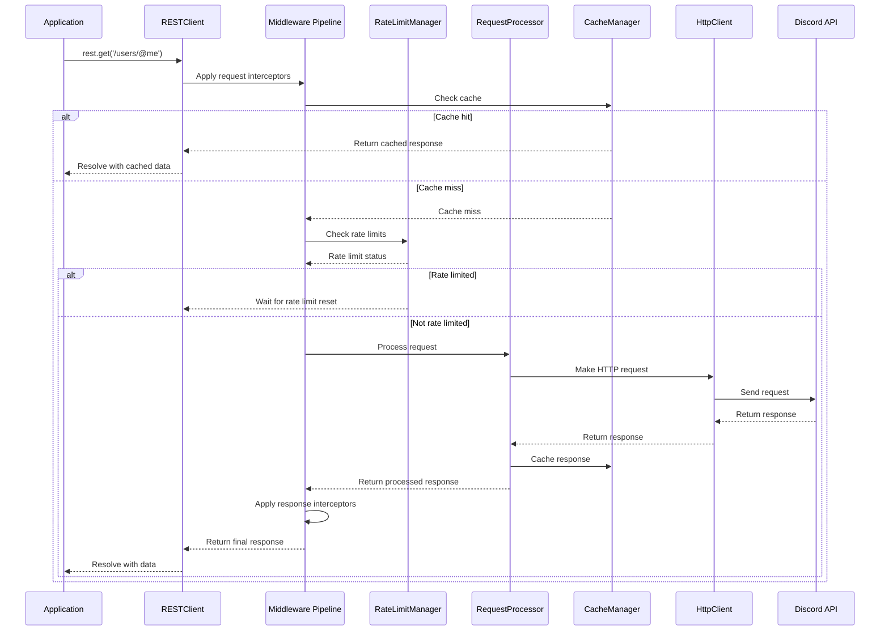
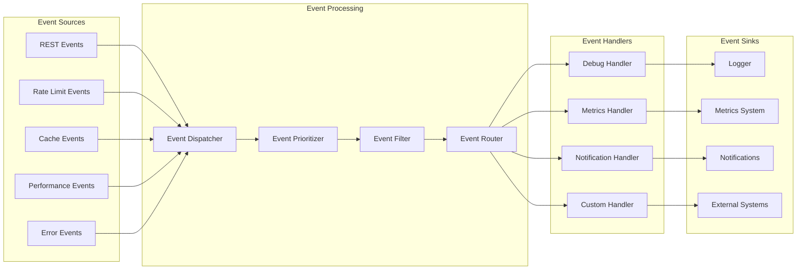
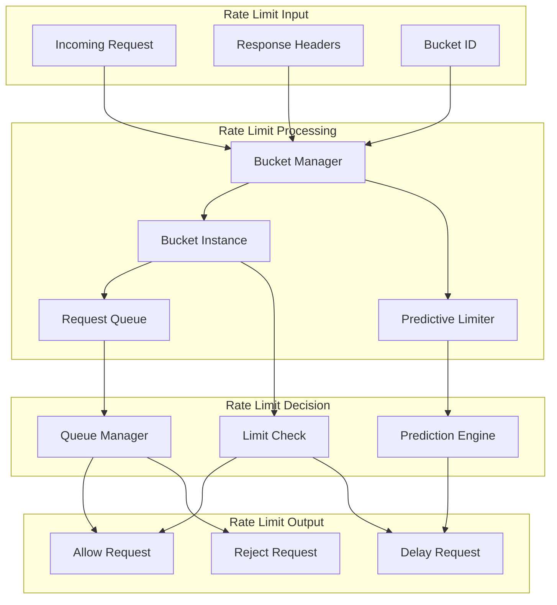
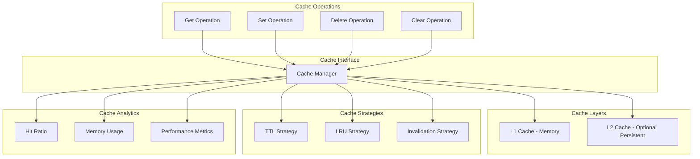

# Enhanced REST Package Architecture Diagram

## System Architecture Overview

```mermaid
graph TB
    subgraph "Client Application"
        APP[Application Code]
    end

    subgraph "@ovendjs/rest Package"
        subgraph "Public API"
            REST_CLIENT[RESTClient]
        end

        subgraph "Core Components"
            RL_MANAGER[RateLimitManager]
            REQ_PROCESSOR[RequestProcessor]
            CACHE_MANAGER[CacheManager]
            EVENT_SYSTEM[EventSystem]
        end

        subgraph "HTTP Layer"
            HTTP_CLIENT[HttpClient]
            CONN_POOL[ConnectionPool]
            RESP_HANDLER[ResponseHandler]
        end

        subgraph "Middleware Pipeline"
            REQ_INTERCEPTORS[Request Interceptors]
            RESP_INTERCEPTORS[Response Interceptors]
            ERROR_HANDLERS[Error Handlers]
            RETRY_MIDDLEWARE[Retry Middleware]
        end

        subgraph "Rate Limiting"
            BUCKET_MANAGER[BucketManager]
            PREDICTIVE_LIMITER[PredictiveLimiter]
            BUCKETS[Buckets]
        end

        subgraph "Request Processing"
            REQ_QUEUE[RequestQueue]
            REQ_BATCHER[RequestBatcher]
            REQ_CACHE[RequestCache]
        end

        subgraph "Caching Layer"
            MEM_CACHE[MemoryCache]
            CACHE_STRATEGY[CacheStrategy]
        end

        subgraph "Monitoring"
            METRICS_COLLECTOR[MetricsCollector]
            PERF_TRACKER[PerformanceTracker]
            ANALYTICS[Analytics]
        end

        subgraph "Discord API"
            DISCORD_API[Discord REST API]
        end
    end

    %% Connections
    APP --> REST_CLIENT
    REST_CLIENT --> REQ_PROCESSOR
    REST_CLIENT --> RL_MANAGER
    REST_CLIENT --> CACHE_MANAGER
    REST_CLIENT --> EVENT_SYSTEM

    REQ_PROCESSOR --> REQ_QUEUE
    REQ_PROCESSOR --> REQ_BATCHER
    REQ_PROCESSOR --> REQ_CACHE
    REQ_PROCESSOR --> HTTP_CLIENT

    HTTP_CLIENT --> CONN_POOL
    HTTP_CLIENT --> RESP_HANDLER
    HTTP_CLIENT --> DISCORD_API

    REQ_PROCESSOR --> REQ_INTERCEPTORS
    REQ_PROCESSOR --> RESP_INTERCEPTORS
    REQ_PROCESSOR --> ERROR_HANDLERS
    REQ_PROCESSOR --> RETRY_MIDDLEWARE

    RL_MANAGER --> BUCKET_MANAGER
    RL_MANAGER --> PREDICTIVE_LIMITER
    BUCKET_MANAGER --> BUCKETS

    CACHE_MANAGER --> MEM_CACHE
    CACHE_MANAGER --> CACHE_STRATEGY

    EVENT_SYSTEM --> METRICS_COLLECTOR
    EVENT_SYSTEM --> PERF_TRACKER
    EVENT_SYSTEM --> ANALYTICS

    %% Event flows
    EVENT_SYSTEM -.-> APP
    METRICS_COLLECTOR -.-> APP
    PERF_TRACKER -.-> APP
```

## Request Processing Flow

## Event System Architecture

## Rate Limiting Architecture

## Middleware Pipeline Architecture

```mermaid
graph LR
    subgraph "Request Flow"
        REQUEST[Incoming Request]
        INTERCEPTOR1[Interceptor 1]
        INTERCEPTOR2[Interceptor 2]
        VALIDATOR[Request Validator]
        RATE_LIMIT[Rate Limit Check]
        CACHE_CHECK[Cache Check]
        HTTP_CLIENT[HTTP Client]
    end

    subgraph "Response Flow"
        RESPONSE[HTTP Response]
        CACHE_STORE[Cache Store]
        ERROR_HANDLER[Error Handler]
        TRANSFORMER[Response Transformer]
        INTERCEPTOR3[Response Interceptor]
        FINAL_RESPONSE[Final Response]
    end

    REQUEST --> INTERCEPTOR1
    INTERCEPTOR1 --> INTERCEPTOR2
    INTERCEPTOR2 --> VALIDATOR
    VALIDATOR --> RATE_LIMIT
    RATE_LIMIT --> CACHE_CHECK
    CACHE_CHECK --> HTTP_CLIENT
    HTTP_CLIENT --> RESPONSE
    RESPONSE --> CACHE_STORE
    CACHE_STORE --> ERROR_HANDLER
    ERROR_HANDLER --> TRANSFORMER
    TRANSFORMER --> INTERCEPTOR3
    INTERCEPTOR3 --> FINAL_RESPONSE
```

## Cache Architecture

These diagrams illustrate the comprehensive architecture of the enhanced REST package, showing the relationships between components and the flow of data through the system.