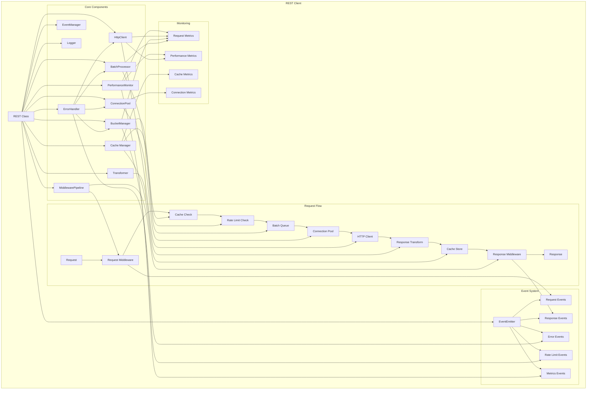

# Enhanced REST Client Architecture Diagram

## Component Interactions

### 1. Request Processing Flow
1. **Request Entry**: Request enters through REST class
2. **Middleware Pipeline**: Request passes through request middleware
3. **Cache Check**: Cache manager checks for cached response
4. **Rate Limiting**: BucketManager checks rate limits
5. **Batching**: BatchProcessor groups compatible requests
6. **Connection**: ConnectionPool provides HTTP connection
7. **HTTP Client**: HttpClient makes the actual request
8. **Response Transform**: Transformer processes response
9. **Cache Store**: Cache manager stores response if needed
10. **Response Middleware**: Response passes through response middleware
11. **Response Return**: Final response returned to caller

### 2. Event System
- **EventEmitter**: Central event dispatching
- **Request Events**: Emitted at various stages of request processing
- **Response Events**: Emitted when responses are received
- **Error Events**: Emitted when errors occur
- **Rate Limit Events**: Emitted when rate limits are hit
- **Metrics Events**: Emitted periodically with performance data

### 3. Monitoring System
- **PerformanceMonitor**: Central metrics collection
- **Request Metrics**: Tracks request count, timing, success rates
- **Performance Metrics**: Tracks overall performance indicators
- **Cache Metrics**: Tracks cache hit/miss ratios
- **Connection Metrics**: Tracks connection pool usage

### 4. Error Handling
- **ErrorHandler**: Centralized error processing
- **Error Classification**: Categorizes errors by type
- **Retry Logic**: Implements retry strategies
- **Circuit Breaker**: Prevents cascading failures
- **Error Events**: Emits error information for monitoring

### 5. Component Integration
- **MiddlewarePipeline**: Provides hooks for request/response processing
- **Transformer**: Handles data serialization/deserialization
- **BucketManager**: Manages rate limiting across all requests
- **CacheManager**: Provides intelligent caching strategies
- **ConnectionPool**: Optimizes HTTP connection usage
- **BatchProcessor**: Groups requests for efficiency